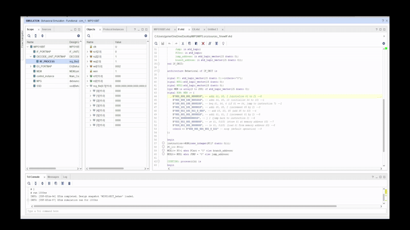
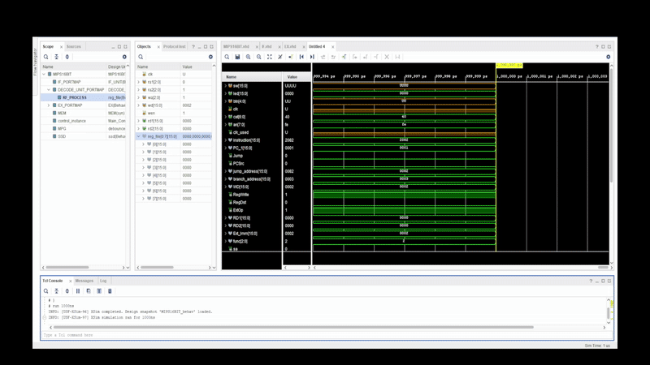

### **📌 16-Bit MIPS Processor**
This simple, harvad architecture single-cycle processor is the result of a semester of computer architecture study, and is an original implementation of the processor. 
The pipelined version of this processor won't be included,
since it consists of just adding intermediary registers in-between each stage, and does not contribute to any significant modifications that affect the functioning of the processor.

The microprocessor will be a simpler version of the MIPS 32 microarchitecture. 
The instruction set will be smaller (fewer instructions to implement). The width of the instructions and data fields
will be of 16-bits. Implicitly, the number of registers used in the register file will be
smaller; the instruction and data memories will be smaller. The rest of the principles will remain the same.


## **🚀 Overview**
This project implements a **16-bit MIPS processor** with a behavioral VHDL description. The processor follows a single-cycle architecture, including key components such as instruction fetch, decode, execute, memory, and control units.

### **🖼 Project Structure**
The main module, `MIPS16BIT.vhd`, integrates various submodules, as shown below:

- **Instruction Fetch Unit (`IF.vhd`)**
- **Decode Unit (`decode_unit.vhd`)**
- **Execution Unit (`EX.vhd`)**
- **Memory (`MEM.vhd`)**
- **Control Unit (`main_control.vhd`)**
- **Debouncer Module (`debouncer.vhd`)**
- **SSD Display Module (`SSD.vhd`)**

## **📸 Screenshots of the general architecture**

### The 32 bit counterpart
The datapath for the 32 bit version used at starting point:


---

### The instruction format for the instruction types
The instruction format for the 16 bit version:


---

## **📚 MIPS Stages Breakdown**
The processor follows a **5-stage execution for each instruction**, each being responsible for specific tasks:

1. **Instruction Fetch (IF)**
   - Retrieves the instruction from memory.
   - Involves **PC (Program Counter)** and **Instruction Memory**.

2. **Instruction Decode (ID)**
   - Decodes the instruction and reads register values.
   - Uses the **Register File** and **Control Unit**.

3. **Execution (EX)**
   - Performs arithmetic and logic operations using the **ALU**.
   - Handles branch calculations.

4. **Memory Access (MEM)**
   - Accesses data memory for load/store instructions.
   - Uses the **Data Memory module**.

5. **Write Back (WB)**
   - Writes the result back to the register file.


---

## **🖥 RTL Design Screenshot**
Below is the generated **RTL schematic** from Vivado for the MIPS processor.


---


## **🎥 MIPS Assembly Showcase**

### **Overview**
This MIPS assembly program demonstrates basic operations such as addition, branching, loops, memory storage, and loading values back from memory. 
The program initializes registers, enters a loop where values are updated, and finally stores and loads data from memory.

### **📜 MIPS Assembly Instructions**
Below is the **MIPS assembly program** demonstrating basic arithmetic, branching, looping, and memory operations, encoded on my own chosen instruction codes.

```assembly
    B"001_000_001_0000010", -- addi $1, $0, 2 (initialize $1 to 2) --0
    B"001_000_100_0001010", -- addi $4, $0, 10 (initialize $4 to 10) --1
    B"100_001_100_0000100", -- beq $1, $4, 4 (if $1 == $4, jump to instruction 7) --2
    B"001_101_101_0000010", -- addi $5, $5, 2 (increment $5 by 2) --3
    B"000_011_101_011_0_000", -- add $3, $3, $5 (add $5 to $3) --4
    B"001_001_001_0000010", -- addi $1, $1, 2 (increment $1 by 2) --5
    B"111_0000000000010", -- j 2 (jump back to instruction 2) --6
    B"011_011_001_0000000", -- sw $1, 0($3) (store $1 at memory address $3) --7
    B"010_011_001_0000000", -- lw $1, 0($3) (load $1 from memory address $3) --8
    others => B"000_001_001_001_0_111" -- noop (default operation) --9
```

### **Instruction Breakdown**
| Address | Instruction | Meaning |
|---------|------------|---------|
| **0** | `addi $1, $0, 2` | Initialize `$1 = 2` |
| **1** | `addi $4, $0, 10` | Initialize `$4 = 10` |
| **2** | `beq $1, $4, 4` | If `$1 == $4`, jump to instruction **7** (not taken initially) |
| **3** | `addi $5, $5, 2` | Increment `$5` by 2 |
| **4** | `add $3, $3, $5` | Add `$5` to `$3` |
| **5** | `addi $1, $1, 2` | Increment `$1` by 2 |
| **6** | `j 2` | Jump back to instruction **2** |
| **7** | `sw $1, 0($3)` | Store `$1` at memory address `$3` |
| **8** | `lw $1, 0($3)` | Load from memory address `$3` back into `$1` |

### **Final Register Values**
After execution:

- **$1 = 10** (restored from memory)
- **$3 = 20** (accumulated from `$5` additions)
- **$4 = 10**
- **$5 = 8**

### 🔄 A tracing of the program, with the code to the side
Here, the program will be traced line by line:



### 🔄 A tracing of the program, with the signals on the side
Here, the program will be traced line by line, but the signal values given by control unit will be presented in the waveform diagram:



### **Summary**
This program successfully demonstrates the working of the MIPS architecture on 16 bits.


---

### **📌 How to Run**
1. Open **Vivado** and load the project.
2. Compile and simulate `MIPS16BIT.vhd`.
3. Run waveform analysis to verify execution.

---

