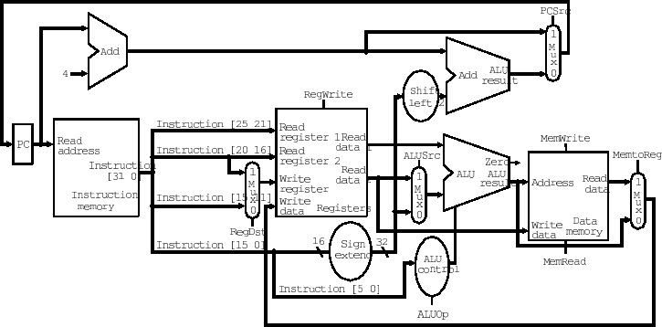

### **📌 16-Bit MIPS Processor**
This simple, harvad architecture single-cycle processor is the result of a semester of computer architecture study, and is an original implementation of the processor. 
The pipelined version of this processor won't be included,
since it consists of just adding intermediary registers in-between each stage, and does not contribute to any significant modifications that affect the functioning of the processor.

The microprocessor will be a simpler version of the MIPS 32 microarchitecture. 
The instruction set will be smaller (fewer instructions to implement). The width of the instructions and data fields
will be of 16-bits. Implicitly, the number of registers used in the register file will be
smaller; the instruction and data memories will be smaller. The rest of the principles will remain the same.

## **🚀 Overview**
This project implements a **16-bit MIPS processor** with a behavioral VHDL description. The processor follows a single-cycle architecture, including key components such as instruction fetch, decode, execute, memory, and control units.

### **🖼 Project Structure**
The main module, `MIPS16BIT.vhd`, integrates various submodules, as shown below:

- **Instruction Fetch Unit (`IF.vhd`)**
- **Decode Unit (`decode_unit.vhd`)**
- **Execution Unit (`EX.vhd`)**
- **Memory (`MEM.vhd`)**
- **Control Unit (`main_control.vhd`)**
- **Debouncer Module (`debouncer.vhd`)**
- **SSD Display Module (`SSD.vhd`)**

## **📸 Screenshots of the general architecture**

### The 32 bit counterpart
The datapath for the 32 bit version used at starting point:

---

### The instruction format for the instruction types
The instruction format for the 16 bit version:

---

## **📚 MIPS Stages Breakdown**
The processor follows a **5-stage pipeline**, each responsible for specific tasks:

1. **Instruction Fetch (IF)**
   - Retrieves the instruction from memory.
   - Involves **PC (Program Counter)** and **Instruction Memory**.

2. **Instruction Decode (ID)**
   - Decodes the instruction and reads register values.
   - Uses the **Register File** and **Control Unit**.

3. **Execution (EX)**
   - Performs arithmetic and logic operations using the **ALU**.
   - Handles branch calculations.

4. **Memory Access (MEM)**
   - Accesses data memory for load/store instructions.
   - Uses the **Data Memory module**.

5. **Write Back (WB)**
   - Writes the result back to the register file.

---

## **🖥 RTL Design Screenshot**
Below is the generated **RTL schematic** from Vivado for the MIPS processor.

---

### **📌 How to Run**
1. Open **Vivado** and load the project.
2. Compile and simulate `MIPS16BIT.vhd`.
3. Run waveform analysis to verify execution.

---

